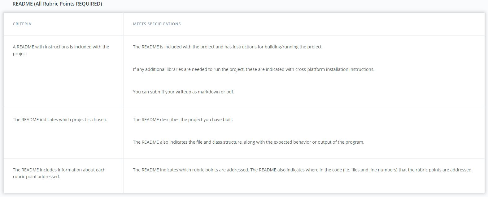
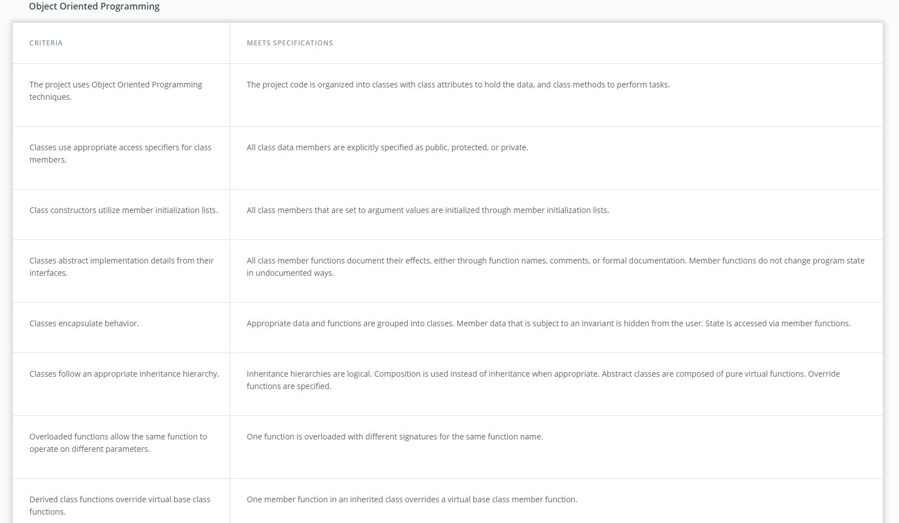
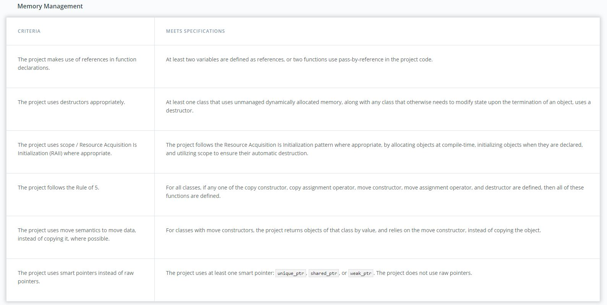

# Steps to Complete the Capstone

## Step 1: Propose a Project
Identify the application you want to build. We recommend keeping the functionality as simple as possible to start with. Note that it is fine to reuse code from any of the courses in the Nanodegree as a starting point. You are also welcome to use the Snake game sample code to extend with additional features or to build an entirely different game. If you prefer to start from scratch, you can find a starter repo here.

## Step 2: Scope the Project
Review the rubric. Ensure that the application you build will satisfy all criteria for the “README” and “Compiling and Testing” sections, and that the application will satisfy at least 5 total criteria from the rest of the rubric. Not all rubric items need to be satisfied in order to pass the project. Scope the features of your project to meet the rubric criteria you want to target.

This flexibility will allow you to focus on the aspects of your application that interest you most.

## Step 3: Build your application
Build your own application, or extend the Snake game with new features.

## Step 4: Document Your Work
Write a short README indicating which project option you chose. The README should also include:

* instructions for running the project
* an overview of your code structure
* an explanation of how your submission satisfies the necessary rubric:

